# Team : Shock Orbital.

Members:

- Arturo Adrian Juarez Nava.
- Josué Uriel Martínez Ruíz.
- Samantha Citlally Castro Rojas.
- Susana Silva Hernández.
- Uriel Salazar Granda.

## Summary

Shock Orbital is an educational platform designed for children aged 8 to 12 that transforms the complex topic of meteorites into a fun and accessible experience. It combines an informative website with vibrant colors and simple language with an immersive Roblox experience where children become "Space Rangers" to complete educational missions.

The platform uses real-world NASA data, includes interactive simulations, a chatbot called Lunino to answer questions, and 3D models of meteorites. The platform aims to bridge the gap between advanced scientific knowledge and public understanding by fostering learning through interactive content and games.

## Goals

- Simulation and Visualization:

We will develop interactive 3D simulations, using the Oak platform, that will display meteorite orbital trajectories using real NASA data. This simulation will allow users to visualize how these objects move in space and their relationship with Earth in an intuitive and engaging way for our end users.

- Impact Examples:

We will create visual examples of impacts based on historical data and calculated scientific projections, showing different scenarios depending on the size and composition of the meteorite, to help understand the possible effects in a user-friendly way.

- Consequence Prediction and Relationships with Natural Disasters:

We will implement simple models that relate impact energy to equivalent natural phenomena, such as comparing the energy released with earthquakes or tsunamis using NASA data, making the concept of impact scale tangible for our tool.

- Mitigation Strategies:

We will design interactive interfaces where users can experiment with real strategies for deflecting celestial bodies in an emergency.

## Description

Shock Orbital is an educational platform designed for children ages 8-12 that combines an interactive website with an immersive Roblox experience to teach about meteorites, their orbital trajectories, historical impacts, and mitigation strategies, using real-world NASA data and tools such as 3D simulations, an educational chatbot called Lunino, and visual comparisons to make the content accessible and engaging.

## Proposed Solution

Our Kids' Website:

Designed with vibrant colors, engaging illustrations, and simple language to help children understand the topic.\
It also features comparisons that children easily understand.

Example: "An asteroid the size of a school would release the energy of 100 erupting volcanoes."

Simple simulations where they can view records of previous meteorite falls and see the consequences.\
In the future, we hope to add a guide character, which would be an astronaut and alien avatar that explains scientific concepts through conversation with users.

The Roblox experience:

It is presented as an educational game where children become "Space Rangers," completing missions through experiences such as deflecting asteroids using real-world methods, using telescopes to detect threats, and visual comparisons where they can see how a meteorite compares to familiar objects schools, stadiums, etc.

## Technologies Used

To carry out our project we used:

- Miro.
- Figma.
- Google colab.
- Git hub.
- Roblox Studio Hub

We used AI as a tool to understand the technical problem of the project, hence, accelerating the creation of our solution by comparing multiple solutions at once:

- DeepSeek - For technical problem-solving and code architecture.
- GitHub Copilot - For code assistance and development acceleration.
- Google Gemini - For content refinement and educational material development.
- ChatGPT - For brainstorming educational content and generating initial dialogue flows.
- Masterpiece X - For 3D model prototyping and conceptual design of space objects.

## Justification

We noted a significant gap between the advanced scientific knowledge used on official NASA platforms about meteorites and public understanding, especially among children.

Children receive fragmented and often alarmist information about space objects, generating unnecessary confusion or fear in the absence of clear knowledge of the risks posed by meteorites.

## Workflow

Our team implemented an agile methodology using Miro as a platform, starting with a brainstorming session where we identified all the concepts we all liked.

We then prioritized the deliverables we needed to complete, followed by dedicated ideation sessions for the website and the Roblox experience separately, ensuring each component had a distinct yet complementary approach.

We set realistic goals for our resources and timelines, established the necessary documentation requirements, and culminated with an equitable distribution of tasks based on each team member's strengths. We maintained constant communication through follow-up meetings in Miro that allowed us to regularly adjust our course.

## Methodologies

As a team, we decided to adopt the Agile Development Model as the methodological foundation for project development, implementing an iterative approach and increasing the number of resources that allowed us to quickly adapt to changes and prioritize features based on their educational value, at our discretion.

## Demo web page

Our website prototype is designed as an engaging educational platform about meteorites, featuring four main pages and two interactive frames to enhance learning for children.

The prototype consists of four primary pages:

1. Principal Page - Introduces basic meteorite information including definitions, characteristics, and classification types.
2. Story of Meteorites - Showcases the most significant meteorites that have impacted Earth, detailing their dates, locations, and effects.
3. Real Comparison - Provides size comparisons between meteorites and real-life objects for better understanding of measurements.
4. Predictions - Displays real-time orbital data of current meteorites, building upon knowledge from previous sections.

Two consistent interactive frames are integrated throughout the platform:

- An information helper that explains unfamiliar terms.
- Lunino chatbot access for answering additional questions beyond the page content.

All pages include a navigation bar for seamless movement between sections. The Story and Real Comparison pages feature direct links to our Roblox server, where children can experience immersive simulations and learn more about meteorite impacts through gameplay.

This comprehensive approach allows children to progressively build their understanding - from fundamental concepts to historical impacts, comparative analysis, and real-time tracking, with continuous support through interactive assistance tools.

For seeing the full mockups, here is the link:
https://www.figma.com/design/hQmbNH7qMSflPp7laP8ToP/Untitled?node-id=39-435&t=RuH4d7uaWCdBlY7T-1

## Chatbot

Lunino Chatbot Documentation - Conversation Flows

Introduction

Lunino is an educational chatbot designed specifically for children ages 8-12, serving as an interactive guide for learning about asteroids, meteorites, and planetary protection. Its conversational design uses simple language, understandable analogies, and visual elements (emojis) to make complex scientific concepts accessible.

Main Conversation Flows

1. FLOW: Hello

Purpose: To establish a friendly connection and present the available learning options.

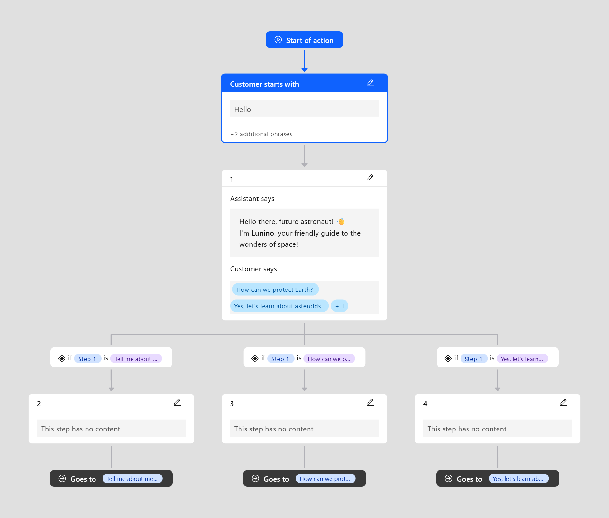

2. FLOW: "Yes, let's learn about asteroids!"

Purpose: To explain what asteroids are in a simple and visual way.

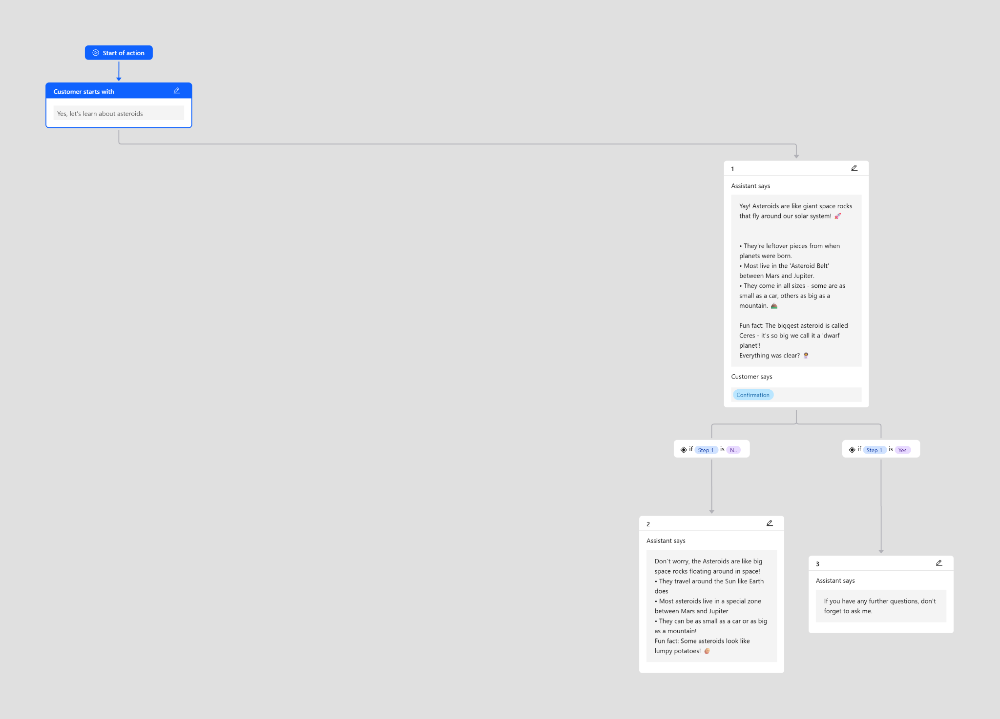

3. FLOW: "Tell me about meteorites!"

Purpose: To differentiate between meteoroids, meteors, and meteorites through a simple analogy.

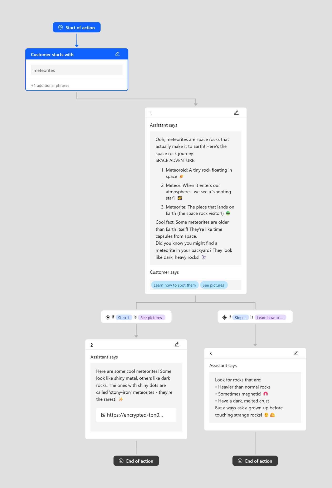

4. FLOW: "How can we protect Earth?"

Purpose: To empower the child by presenting protection strategies as accessible tools.

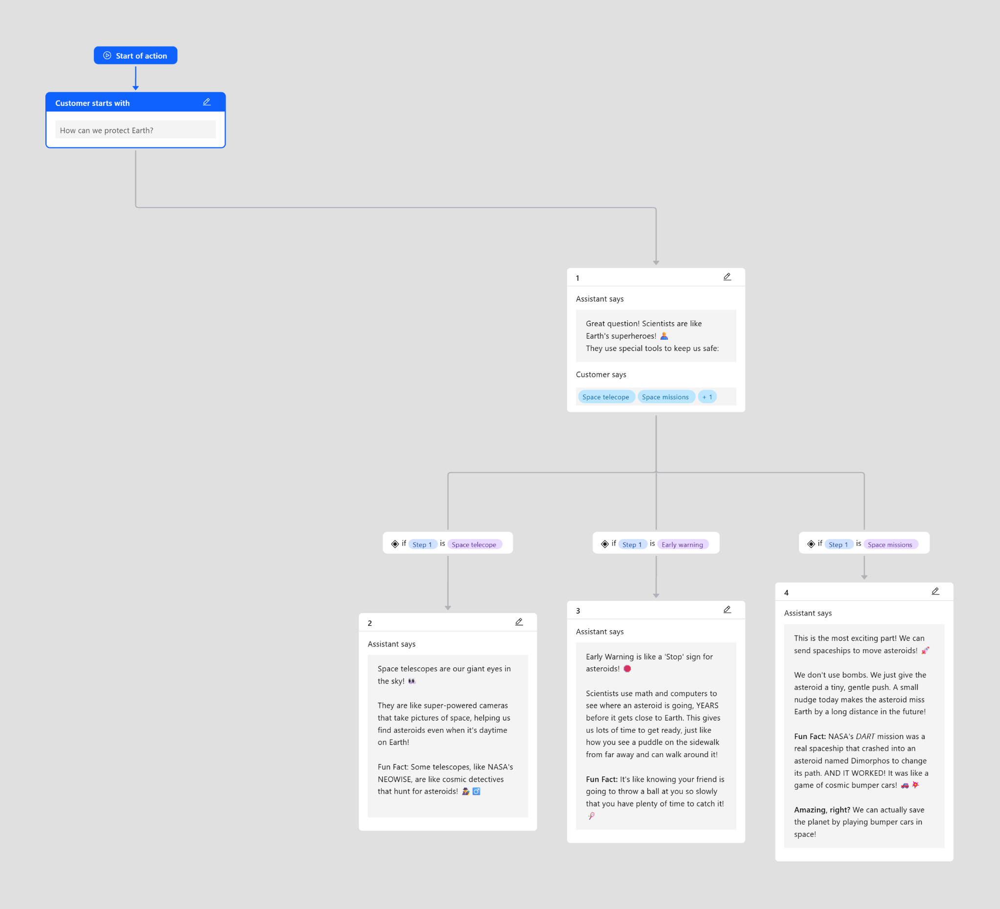

## Avatar Roblox

As a key component of our "Orbital Shock" educational platform, I designed and developed an interactive 3D model of a meteorite. This model was created to provide children with a tangible and engaging way to visualize and understand the structure and composition of these celestial objects.

Built using Masterpiece X for initial prototyping and refined in Blender, the model allows users to rotate, zoom, and explore the meteorite's surface details. It serves as a central visual asset in our web platform's "Real Comparison" section and has been optimized for integration into the Roblox experience, helping to bridge the gap between theoretical learning and immersive interaction.

Link 3D model Lunino:

[https://app.masterpiecex.com/library/3800](https://app.masterpiecex.com/library/3800)

Link 3D model:

[https://app.masterpiecex.com/library/3801](https://app.masterpiecex.com/library/3801)

## Storyboard

When designing the storyboard, we describe the visual narrative and user experience of "Orbital Shock," our educational platform about meteorites designed for children. The following pages trace the journey a young user will take, starting with the main dashboard ("SHYCK SIRBITAL") and progressing through key interactive sections such as "Chexclob" (the Roblox experience) and "Sure Crazer" (the size comparison tool).

The storyboard visualizes the fluidity between the website's main pages and its interactive frameworks, ensuring that information is presented in an engaging, logical, and kid-friendly way. It serves as a foundation for our development team, guiding the creation of a seamless adventure, from learning basic concepts on the web to exploring immersive simulations in Roblox.

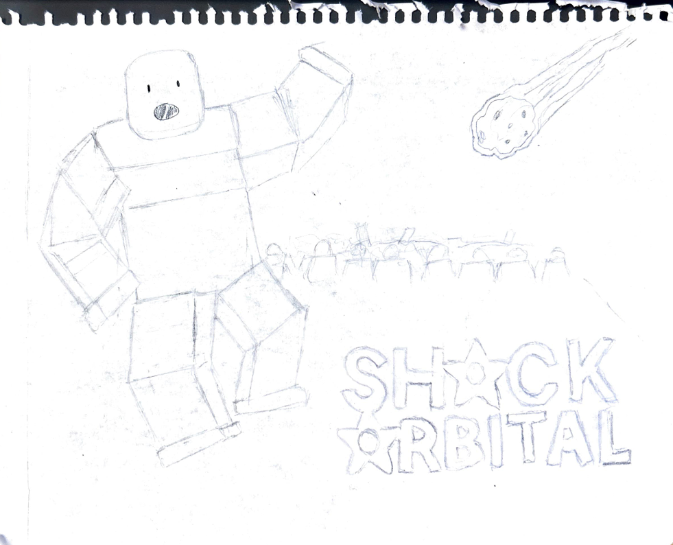

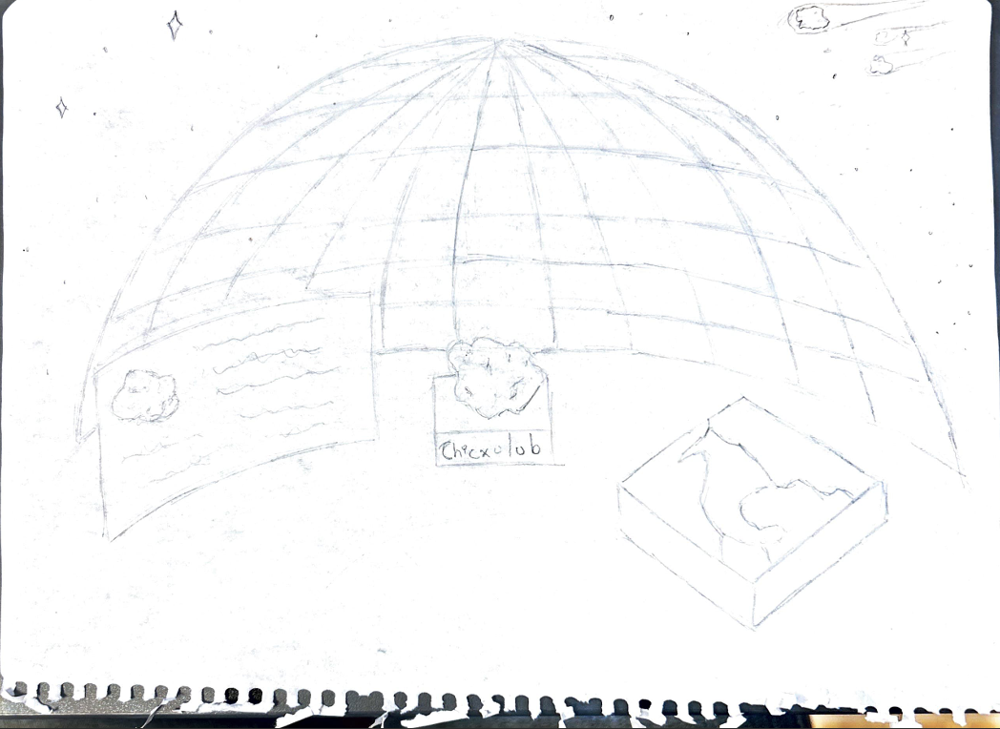

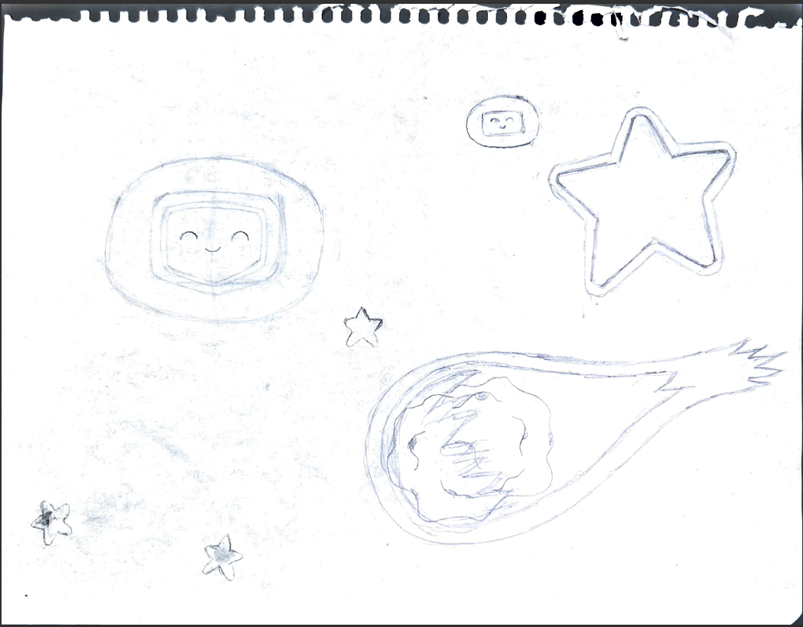

## Roblox

As part of our visualization strategy, we created a custom map in Roblox Studio to simulate how the final product might look and feel in an interactive environment. This space was designed not only as a technical demonstration but also as a playful gateway for children to engage with the topic of meteorites. By integrating a game-like experience, we aimed to spark curiosity and make scientific concepts more accessible and enjoyable. The Roblox environment allows children to explore impact zones, interact with educational elements, and immerse themselves in a narrative that complements the website. This dual-platform approach reinforces learning through both structured content and exploratory play.

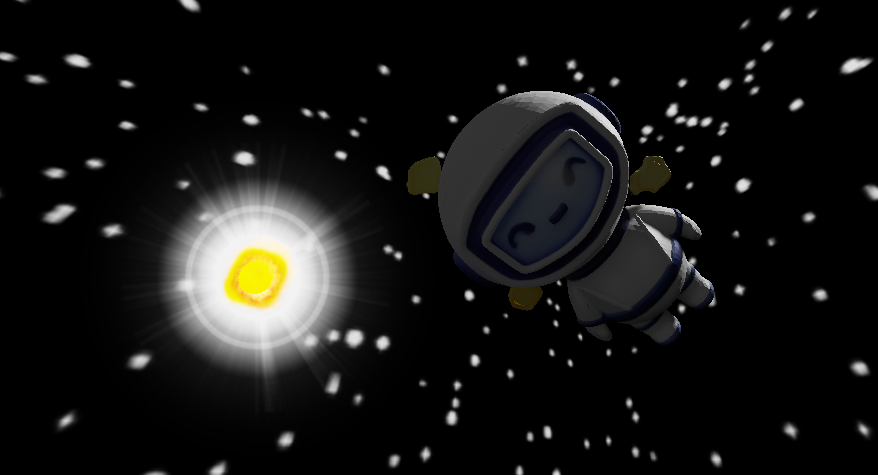

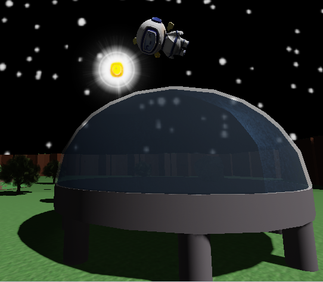

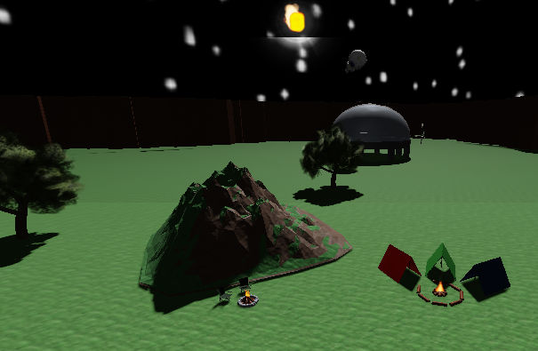

Gamifying the website by presenting famous meteorites and near-Earth objects in an engaging, educational way for kids and teens. The prototype features Lunino (the site mascot) and visualizes data from a meteorite/NEO database.

**Our goals with this game:**

- Spark curiosity about meteorites and space rocks.
- Teach basic concepts: differences between meteor, meteoroid, meteorite, asteroid; scale/size; impact effects.
- Encourage safe, exploratory interaction with scientific data.

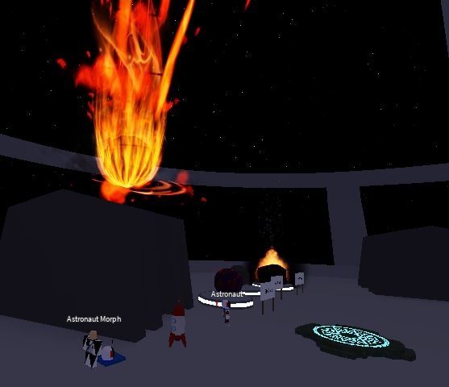

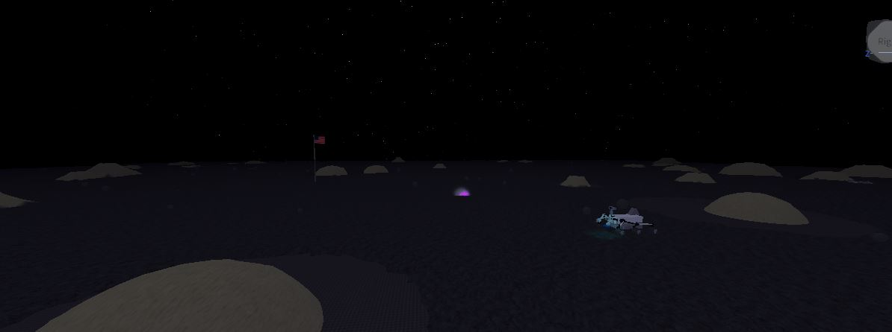

## Databases, data analysis and Backend

We are developing an interactive cosmic analytics platform that transforms NASA asteroid data into immersive educational and gaming experiences. Using NASA's Near Earth Object (NEO) API, we have compiled a historical database of asteroid close approaches to Earth (2015--2025), including detailed physical and orbital characteristics.

In future implementations, the asteroid database will serve as the foundational data layer for a multi-platform ecosystem comprising a Roblox meteor simulation server, an educational web portal, and machine learning prediction services.

The companion web platform will serve as both an educational resource and data visualization tool. Users will be able to query the asteroid database through an intuitive interface, accessing detailed information about specific celestial objects or exploring statistical trends across the decade-long dataset.This infrastructure will transform raw astronomical data into engaging, interactive experiences across multiple digital environments.

## Contributors

**Arturo Adrián Juárez Nava**

Role: API Data Analysis and Integration

- Performed a thorough analysis of NASA and USGS NEO API datasets to extract relevant astronomical data.
- Developed Python scripts to process and integrate real-time asteroid orbital parameters and impact data.
- Established API connection protocols for seamless data retrieval and updating.

**Josué Uriel Martínez Ruíz**

Role: Project Documentation and Chatbot

- I wrote and maintained complete project documentation, including technical specifications and user guides.
- I developed the educational content framework, ensuring scientific accuracy and using child-friendly language.
- I created the chatbot dialog flows and interactive learning scenarios for Lunino.

**Samantha Citlally Castro Red**

Role: UX/UI Design and Prototyping

- Designed the complete user interface and experience for the educational website using Figma.
- Created wireframes, mockups, and interactive prototypes for web and mobile interfaces.
- Developed the visual design system, including a color palette, typography, and child-friendly iconography.

**Susana Silva Hernandez**

Role: 3D Environment and Asset Design

- Created 3D models of asteroids, spacecraft, and astronomical objects for the Roblox experience.
- Designed the "Space Rangers" game environment and mission-based learning scenarios.
- Optimized 3D assets to improve performance and compatibility with the Roblox platform.

**Uriel Salazar Granda**

Role: Storyboard Design and Game Design

- Developed complete storyboards for Roblox web content and game narratives.
- I collaborated on educational game mechanics and reward systems.
- I ensured a coherent narrative experience between the web platform and the Roblox game.

## Conclusion

In conclusion, Shock Orbital is presented as an innovative educational platform that combines an interactive website and a Roblox experience to transform complex knowledge about meteorites into accessible and engaging content for children aged 8-12, using 3D simulations, real NASA data, educational models and an interactive chatbot, with the aim of bridging the gap between advanced scientific information and public understanding, fostering learning through play and exploration.
